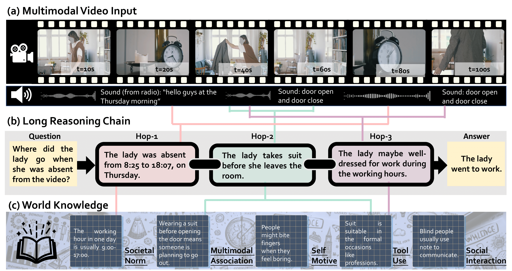

# WorldQA: Multimodal World Knowledge in Videos through Long-Chain Reasoning

## Introduction

We present WorldQA, a video understanding dataset designed to push the boundaries of multimodal world models with three appealing properties:

**1. Multimodal Inputs:**  
The dataset comprises 1007 question-answer pairs and 303 videos, necessitating the analysis of both auditory and visual data for successful interpretation.

**2. World Knowledge:**  
We identify five essential types of world knowledge for question formulation. This approach challenges models to extend their capabilities beyond mere perception.

**3. Long-Chain Reasoning:**  
Our dataset introduces an average reasoning step of 4.45, notably surpassing other videoQA datasets.


The evluation of WorldQA is based on the lmms-eval. The dataset of WorldQA will be downloaded automatically through running the evaluation scripts. If you want to view the data, please refer to [WorldQA](https://huggingface.co/datasets/lmms-lab/worldqa)

## Install
1. Install `lmms-eval` as follows
```
git clone https://github.com/EvolvingLMMs-Lab/lmms-eval
cd lmms-eval
git checkout kc/worldqa
pip install -e .
```

2. (Optional) Following the instructions in the `model` folder for [`video_llava`](https://github.com/EvolvingLMMs-Lab/lmms-eval/blob/kc/worldqa/lmms_eval/models/video_llava.py) and [`llama_vid`](https://github.com/EvolvingLMMs-Lab/lmms-eval/blob/kc/worldqa/lmms_eval/models/llama_vid.py) to install the model. And welcome to PR your models.

## Evaluation
Example:
model:  Video-LLaVA-7B
```
export OPENAI_API_KEY="XXXXX" (For open-ended evaluation)
```

```bash
accelerate launch --num_processes=8 --main_process_port 12345 -m lmms_eval \
    --model video_llava   \
    --model_args pretrained='LanguageBind/Video-LLaVA-7B' \
    --tasks worldqa  \
    --batch_size 1 \
    --log_samples \
    --log_samples_suffix debug\
    --output_path ./logs/
```
